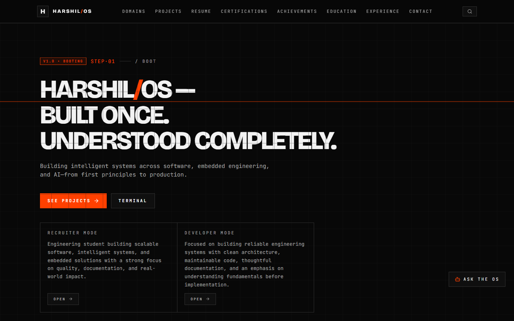
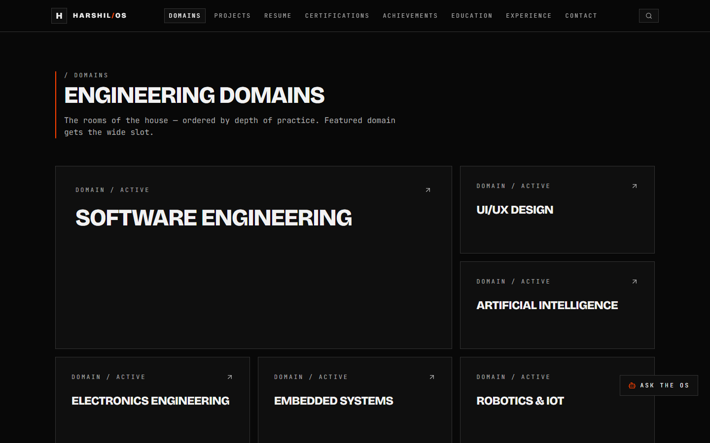
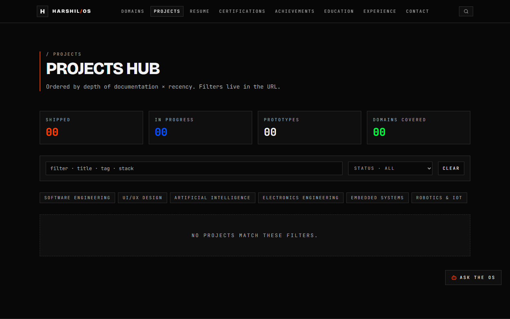
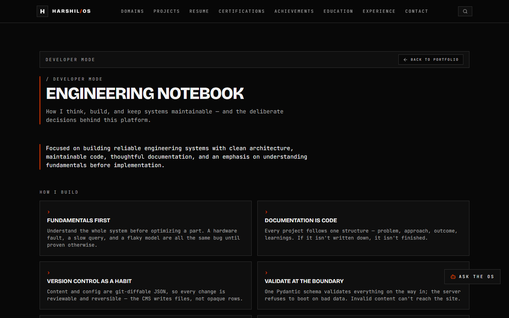
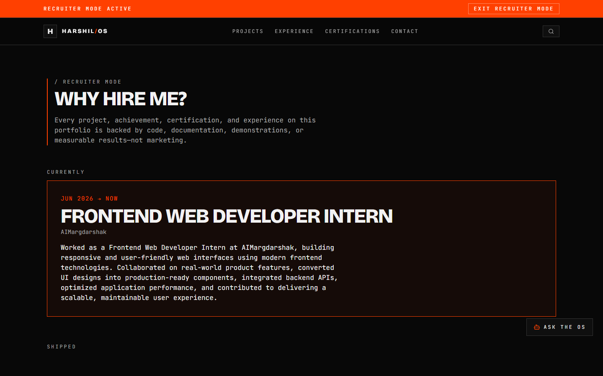
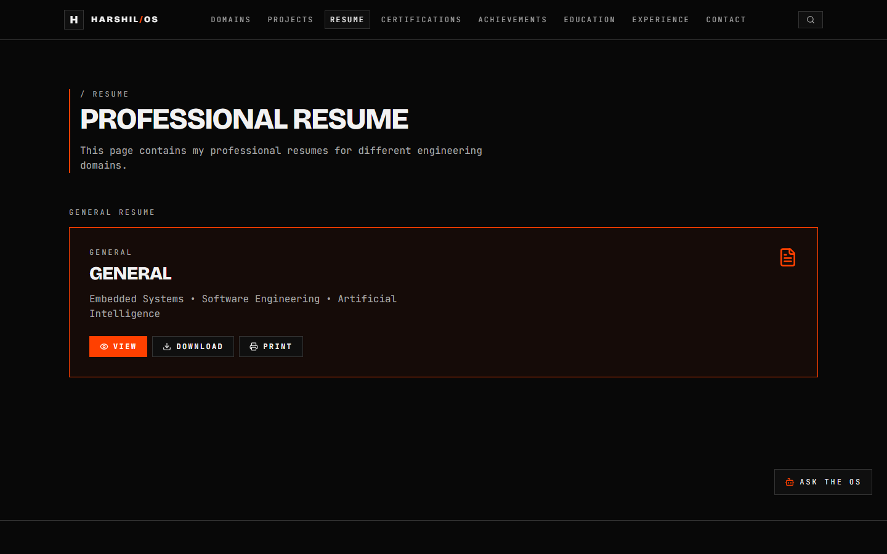
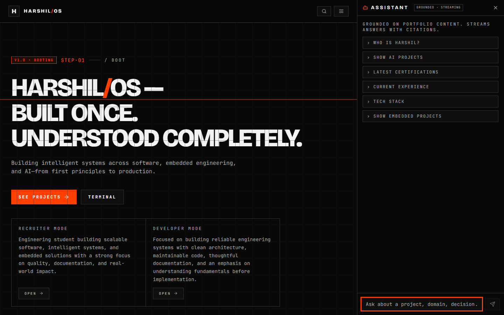
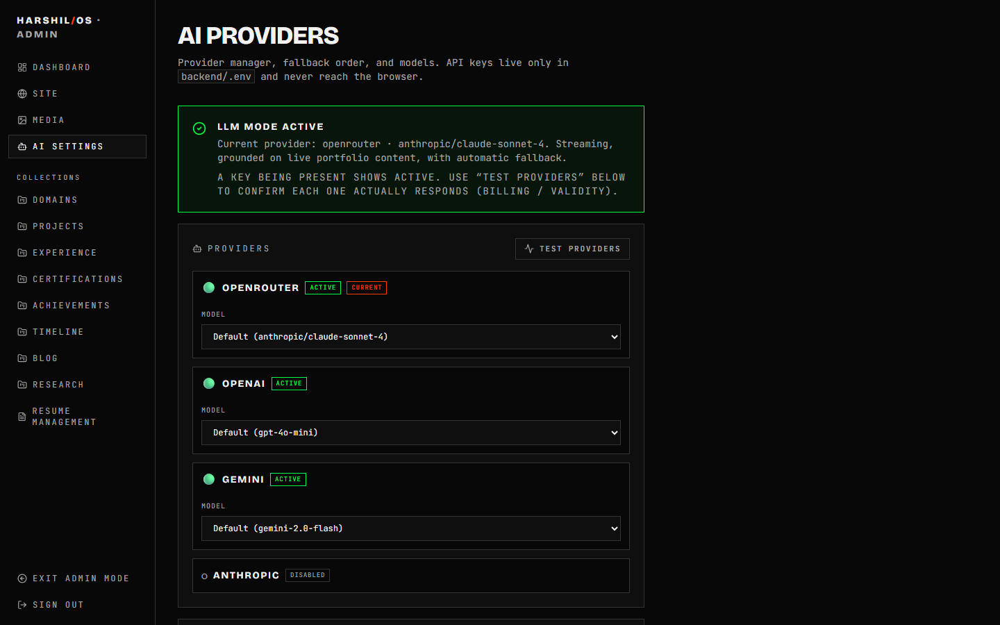
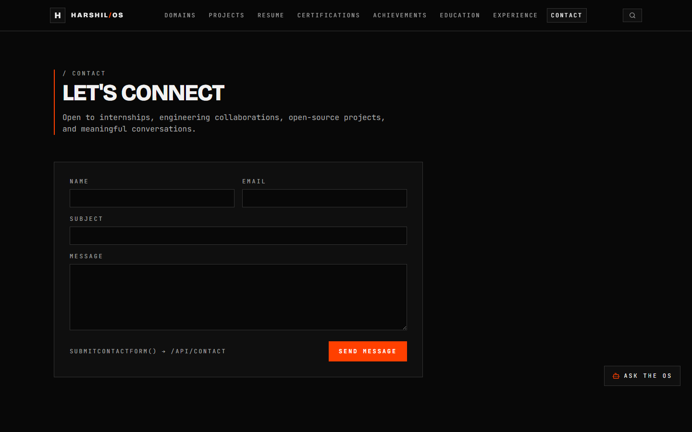

<div align="center">

# Harshil/OS

### An engineering portfolio built like a product — a black/orange "operating system" for showcasing real work.

Full-stack portfolio platform with a headless JSON CMS, an admin panel, a grounded AI assistant with multi-provider fallback, live GitHub integration, and production email — all wrapped in a deliberate industrial design language.

[](https://react.dev)
[](https://fastapi.tiangolo.com)
[](https://tailwindcss.com)
[](https://python.org)
[](LICENSE)

</div>

---



## Overview

**Harshil/OS** is the personal engineering portfolio of **Harshil Jain** (B.Tech ECE, LNMIIT Jaipur), reimagined as a small production platform rather than a static page. Content is data, edited through a password-protected admin panel and validated at the boundary; an embedded AI assistant answers questions grounded in that content; and the whole thing is designed to deploy.

It is open-sourced as a reference for anyone who wants a **content-driven, self-hostable portfolio** with a real backend.

## Features

- 🖥️ **"Operating System" UI** — a cohesive black/orange industrial design language with a boot-sequence hero, keyboard-driven terminal (`⌘/Ctrl+K`), and universal search (`⌘/Ctrl+/`).
- 🧠 **Grounded AI assistant** — retrieval over live portfolio content, streaming (SSE) responses, first-person voice, conversation memory, citations, and suggested follow-ups. Scrolls independently of the page (ChatGPT-style).
- 🔀 **Multi-provider AI with automatic fallback** — OpenRouter → OpenAI → Gemini → Anthropic. Detects available keys, retries the next provider on failure, and never surfaces provider errors to visitors. Live health probe in the admin.
- 🗂️ **Headless JSON CMS** — every collection (projects, domains, experience, certifications, blog, timeline, achievements, resumes) is JSON on disk, schema-validated with Pydantic. The server refuses to boot on invalid content.
- 🔐 **Admin panel** — auth via signed token, schema-driven CRUD forms, drafts/archive, a media library, and AI provider management.
- 📄 **Resume system** — in-browser PDF viewer (zoom / fit / page nav / print / download), lazy-loaded, with per-domain resume variants.
- 📬 **Production contact form** — server-side validation, honeypot spam trap, rate limiting, Resend email delivery, and a durable file fallback so a message is never lost.
- 🐙 **Live GitHub repositories** — real repos (stars, language, description, updated date) via the GitHub API.
- ⚡ **Production-minded frontend** — route-level prerendering (`react-snap`), lazy-loaded heavy chunks (PDF engine), accessible focus/keyboard handling, and a strict no-horizontal-overflow responsive audit.

## Screenshots

| Home | Domains | Projects |
|---|---|---|
|  |  |  |

| Developer Mode | Recruiter Mode | Resume |
|---|---|---|
|  |  |  |

| AI Assistant | Admin — AI Providers | Contact |
|---|---|---|
|  |  |  |

## Architecture

```
┌─────────────────────────────┐        ┌──────────────────────────────────────┐
│  Frontend (React 19 / CRA)  │        │  Backend (FastAPI)                     │
│                             │        │                                        │
│  Pages · Admin · Assistant  │ HTTPS  │  /api/content   headless JSON CMS      │
│  Tailwind · Framer Motion   │◄──────►│  /api/assistant grounded RAG + SSE     │
│  React Query · React Router │  /api  │  /api/contact   Resend + file fallback │
│                             │        │  /api/github    live repos             │
│                             │        │  /api/admin     auth · CRUD · media    │
└─────────────────────────────┘        └───────────────┬──────────────────────┘
                                                        │
                          ┌─────────────────────────────┼───────────────────────────┐
                          │                             │                            │
                   content/*.json               MongoDB (optional)          External APIs
                   (source of truth,             contact submissions        OpenRouter/OpenAI/
                    Pydantic-validated)                                      Gemini · Resend · GitHub
```

The **content JSON files are the source of truth.** They are validated by `models.py` at boot; the AI assistant retrieves over them live, so publishing new content in the admin immediately updates both the site and what the assistant knows — no re-indexing.

See [`docs/Architecture.md`](docs/Architecture.md) for the full write-up.

## Tech Stack

**Frontend:** React 19 · React Router 7 · Tailwind CSS 3.4 · Framer Motion 11 · TanStack Query 5 · react-pdf · CRACO · react-snap

**Backend:** FastAPI · Pydantic v2 · Uvicorn · httpx · slowapi (rate limiting) · Motor (MongoDB, optional)

**Integrations:** OpenRouter / OpenAI / Google Gemini / Anthropic (assistant) · Resend (email) · GitHub REST API

## Folder Structure

```
Harshil-OS/
├── frontend/            # React app (pages, components, admin, assistant)
│   ├── src/
│   │   ├── pages/       # routes incl. pages/admin/*
│   │   ├── components/  # layout, assistant, media, terminal, search, ui
│   │   └── lib/         # api clients, hooks, helpers
│   └── public/
├── backend/             # FastAPI app
│   ├── content/         # JSON CMS — the source of truth (per collection)
│   ├── routers/         # content, assistant, contact, github, admin, seo, og
│   ├── uploads/         # media & resume PDFs served by the app
│   ├── models.py        # Pydantic schemas + COLLECTION_MAP
│   ├── server.py        # app entrypoint (/api router)
│   └── .env.example
├── docs/                # Architecture, Deployment, Admin/Content/AI guides
├── screenshots/         # README imagery
├── .github/             # issue / PR templates
├── README.md · CHANGELOG.md · CONTRIBUTING.md · LICENSE · .gitignore
```

Full annotated tree: [`docs/Folder-Structure.md`](docs/Folder-Structure.md).

## How It Works

1. **Content** lives as JSON in `backend/content/<collection>/*.json`, validated by Pydantic at boot (invalid data ⇒ the server won't start).
2. The **frontend** fetches content via `/api/content/*` and renders it with React Query caching.
3. The **admin panel** (`/admin`) authenticates, then edits those JSON files through schema-driven forms and a media library.
4. The **AI assistant** retrieves the most relevant content per question, streams a grounded answer, and cites sources — falling back across AI providers automatically.
5. The **contact form** validates, checks a honeypot, rate-limits, and sends via Resend (with a durable file fallback).

## Installation

**Prerequisites:** Node 18+, Python 3.11+, (optional) MongoDB.

```bash
git clone https://github.com/<your-username>/Harshil-OS.git
cd Harshil-OS
```

### Backend

```bash
cd backend
python -m venv .venv
# Windows:  .venv\Scripts\activate      macOS/Linux:  source .venv/bin/activate
pip install -r requirements.txt
cp .env.example .env          # then fill in values
uvicorn server:app --host 127.0.0.1 --port 8899
```

### Frontend

```bash
cd frontend
npm install          # or yarn / pnpm
cp .env.example .env # set REACT_APP_BACKEND_URL=http://localhost:8899
npm start            # http://localhost:3000
```

## Environment Variables

All secrets live in `backend/.env` (never committed). See [`backend/.env.example`](backend/.env.example) for the full, commented template.

| Variable | Required | Purpose |
|---|---|---|
| `ADMIN_PASSWORD`, `ADMIN_JWT_SECRET` | ✅ | Admin login + session signing |
| `OPENROUTER_API_KEY` / `OPENAI_API_KEY` / `GEMINI_API_KEY` | ⚠️ one | AI assistant (else retrieval-only) |
| `RESEND_API_KEY`, `RESEND_TO`, `RESEND_FROM` | ✅ (email) | Contact-form delivery |
| `PORTFOLIO_GITHUB_USER` | ✅ | Repositories shown on Developer page |
| `MONGO_URL`, `DB_NAME` | optional | Store contact submissions in a DB |
| `CORS_ORIGINS` | ✅ (prod) | Allowed frontend origins |

Frontend needs only `REACT_APP_BACKEND_URL`.

## Admin Panel

Visit `/admin`, log in with `ADMIN_PASSWORD`. From there you can manage every content collection, upload media, edit resumes, and configure/test AI providers. Full walkthrough: [`docs/Admin-Guide.md`](docs/Admin-Guide.md).

## Content Management

Content is JSON-on-disk, edited through the admin's schema-driven forms (or directly, if you prefer). Each collection maps to a Pydantic model. See [`docs/Content-Guide.md`](docs/Content-Guide.md).

## AI Assistant

A retrieval-grounded assistant that speaks in the first person, remembers the conversation, cites portfolio content, and automatically fails over across AI providers. Configure and health-check it in **Admin → AI Providers**. Details: [`docs/AI-Assistant.md`](docs/AI-Assistant.md).

## Media Library

Upload and organize images, resume PDFs, and other assets from the admin; files are stored under `backend/uploads/` and served by the app. Referenced by content via URL.

## Deployment

- **Frontend → Vercel** (static build of `frontend/`)
- **Backend → Railway or Render** (`uvicorn server:app`)
- **Database → MongoDB Atlas** (optional)

Step-by-step, with every required env var: [`docs/Deployment.md`](docs/Deployment.md).

## Contributing

Contributions are welcome — see [`CONTRIBUTING.md`](CONTRIBUTING.md) and the issue/PR templates in `.github/`.

## License

[MIT](LICENSE) © Harshil Jain.

## Future Roadmap

- [ ] Vector embeddings for retrieval (beyond keyword scoring)
- [ ] Analytics dashboard in the admin
- [ ] Blog authoring with rich media
- [ ] Multi-language content
- [ ] Automated visual-regression tests in CI
- [ ] One-click deploy templates (Vercel + Railway)

## Credits

Designed and built by **Harshil Jain**. Powered by React, FastAPI, and the open-source ecosystem listed above.
